# Guía Completa: Estructura de SAP Business One y Maestro de Clientes

## Incluye Hands-on Practice for SAP Business One Logistics Virtual Machine

> Versión ampliada con laboratorios prácticos, ejercicios funcionales, consultas SQL y proyecto integrador.

# 28. Hands-on Practice for SAP Business One - Logistics Virtual Machine

## Objetivo

El propósito de estos laboratorios es que el estudiante:

- Navegue la interfaz de SAP Business One.
- Comprenda la estructura de los datos maestros.
- Cree clientes y contactos.
- Genere documentos de ventas.
- Analice el impacto financiero de las operaciones.
- Realice consultas SQL sobre SQL Server o SAP HANA.

---

# Laboratorio 1 - Exploración del Entorno SAP Business One

## Actividades

1. Iniciar sesión en SAP Business One.
2. Identificar Finanzas, Compras, Ventas, Inventario y Socios de Negocio.
3. Documentar la navegación.

## Evidencia

Captura de pantalla del menú principal.
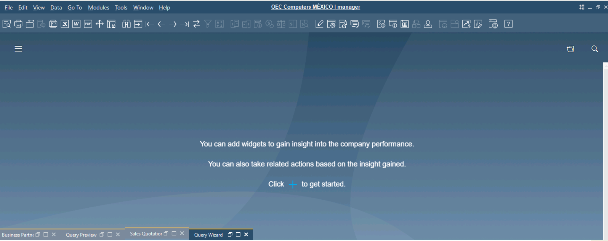
---

# Laboratorio 2 - Creación de un Cliente

Crear:

Código: C-TRAIN-001
Nombre: Cliente Capacitación
RFC: XAXX010101000
Moneda: MXN

Preguntas:

1. ¿Cuál fue el CardCode?
2. ¿Qué campos son obligatorios?
3. ¿Qué validaciones realizó SAP?
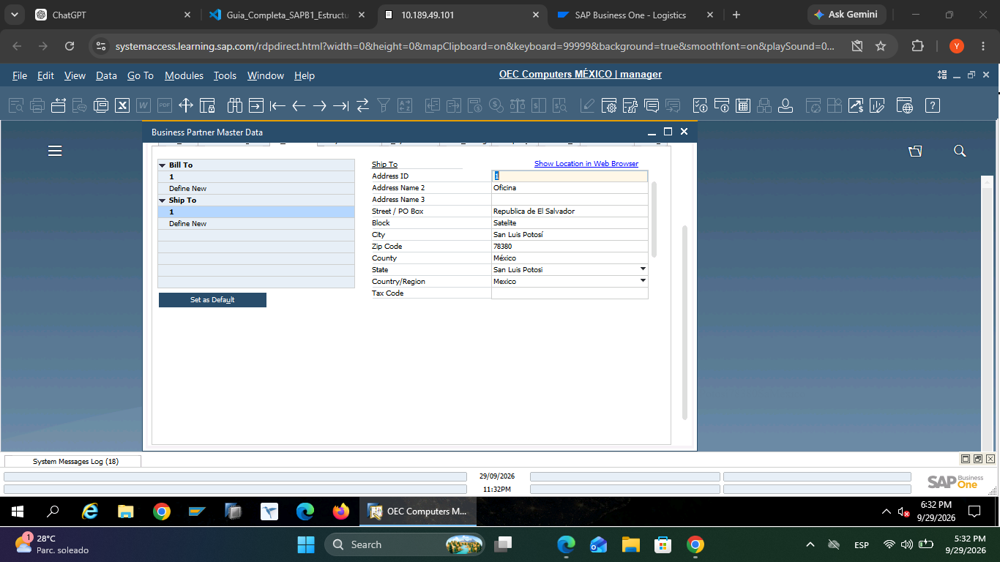
---

# Laboratorio 3 - Direcciones del Cliente

Agregar direcciones de Facturación y Entrega.

Consulta:

```sql
SELECT *
FROM CRD1
WHERE CardCode='C-TRAIN-001';
```
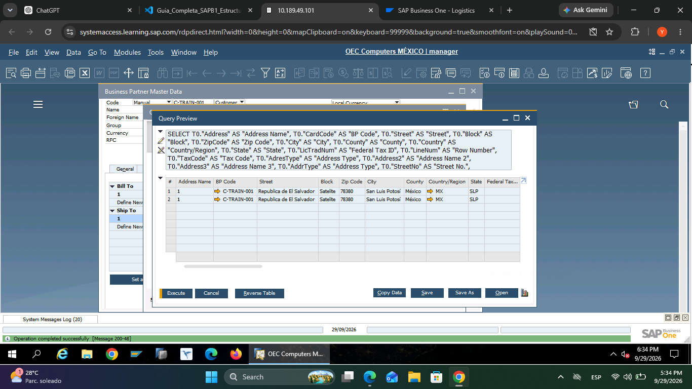
---

# Laboratorio 4 - Contactos

Registrar dos contactos y validar en OCPR.

```sql
SELECT *
FROM OCPR
WHERE CardCode='C-TRAIN-001';
```
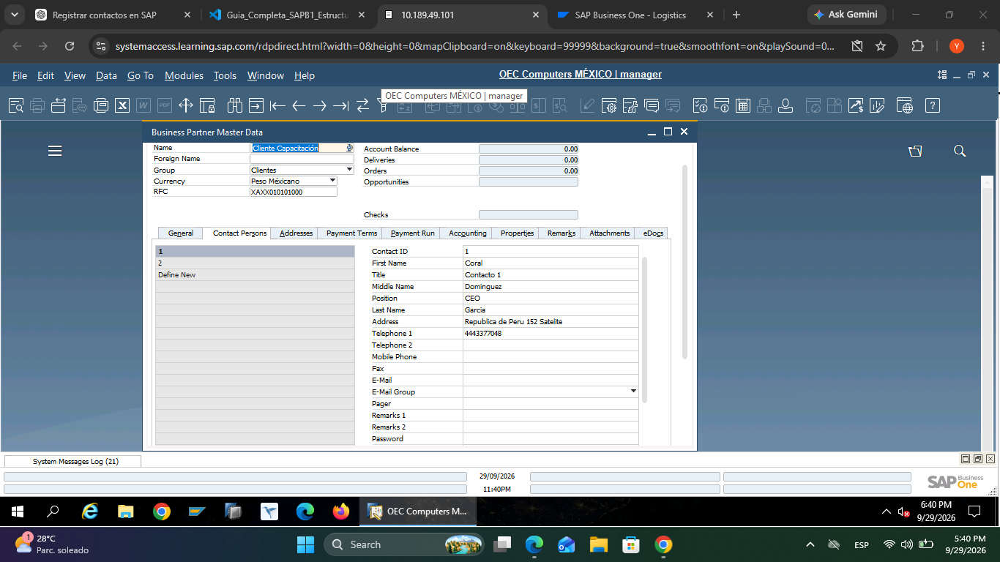
---

# Laboratorio 5 - Condiciones de Pago

Asignar plazo a 30 días.

```sql
SELECT CardCode, GroupNum
FROM OCRD
WHERE CardCode='C-TRAIN-001';
```
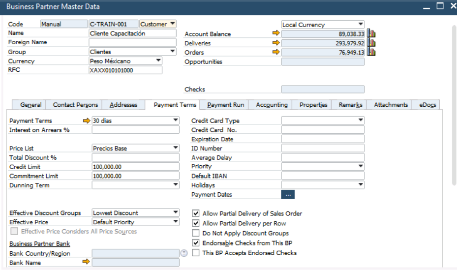
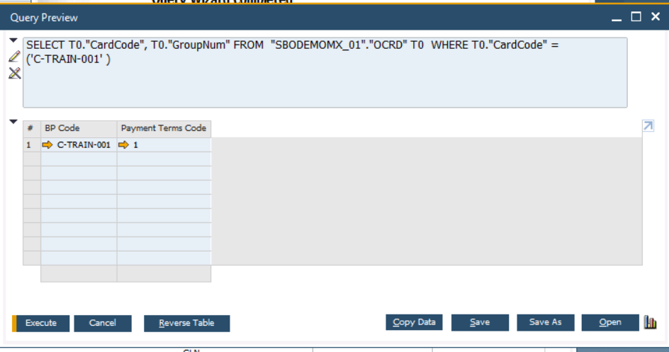
---

# Laboratorio 6 - Límite de Crédito

Asignar límite de crédito de 100,000 MXN.

```sql
SELECT CardCode, CardName, CreditLine
FROM OCRD
WHERE CardCode='C-TRAIN-001';
```
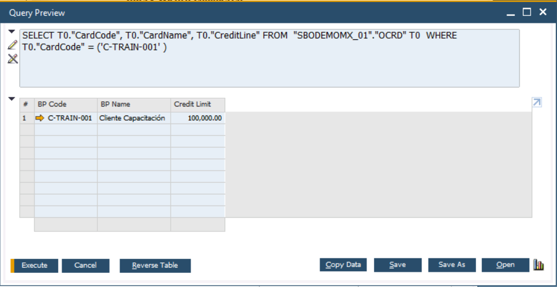
---

# Laboratorio 7 - Flujo Comercial Completo

Flujo:

```text
Cliente
 ↓
Cotización (OQUT)
 ↓
Pedido (ORDR)
 ↓
Entrega (ODLN)
 ↓
Factura (OINV)
 ↓
Pago (ORCT)

```

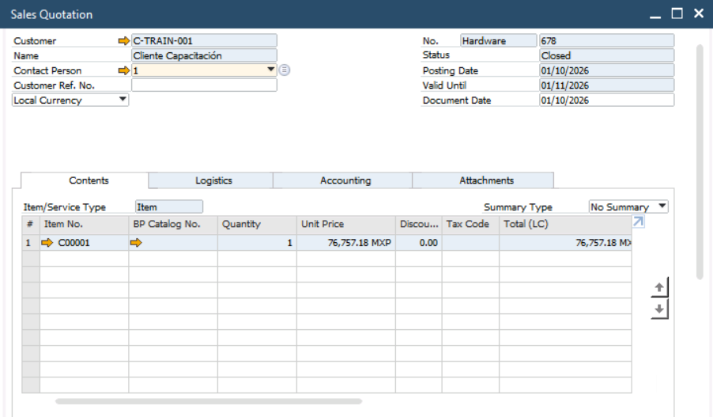
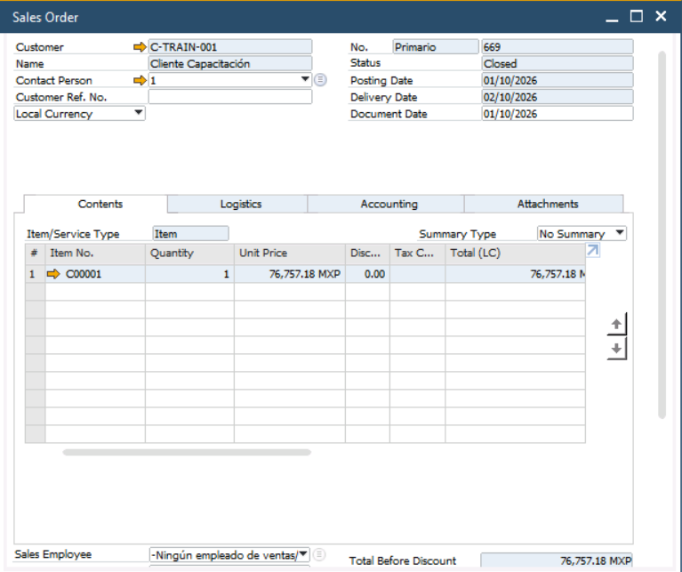
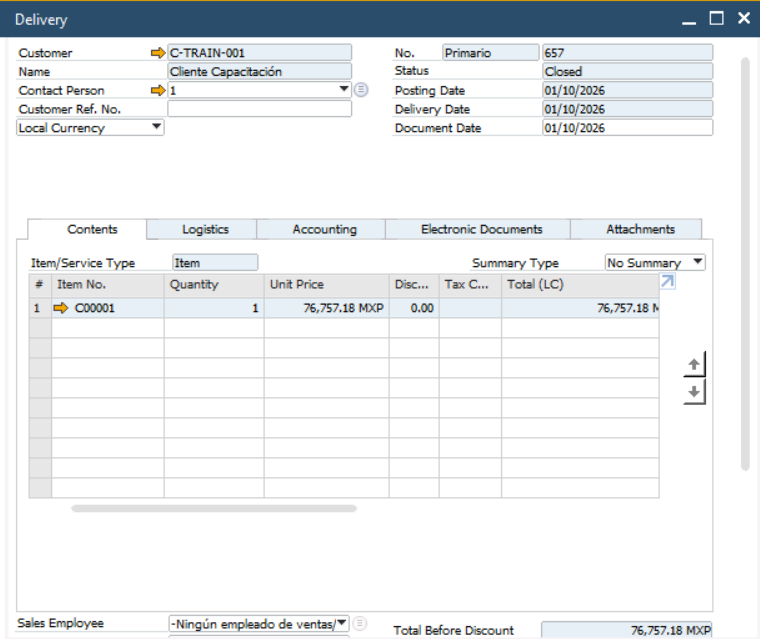
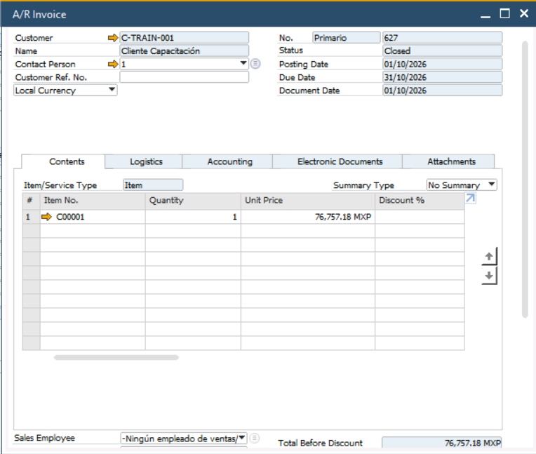
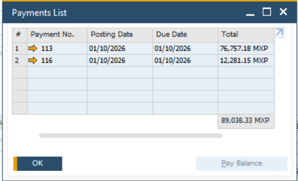

# Laboratorio 8 - Trazabilidad

Utilizar Mapa de Relaciones y documentar los documentos vinculados.
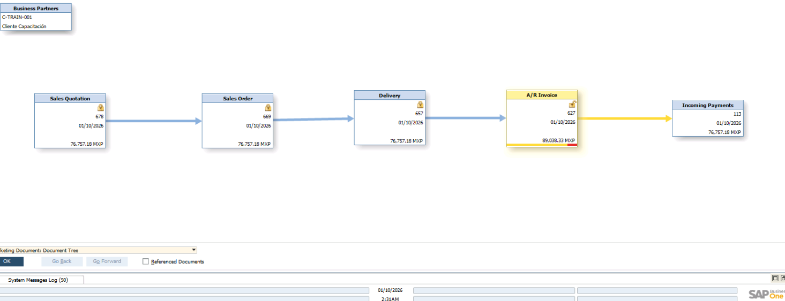
1. Datos Generales del Flujo
    Socio de Negocios: C-TRAIN-001 - Cliente Capacitación   
    Moneda de la Operación: Peso Mexicano (MXP)   
    Herramienta Utilizada: Mapa de Relaciones (Relationship Map)
2. Lista de Documentos Vinculados en la Cadena de TrazabilidadPaso 
    1: Cotización de VentasNombre en SAP: Sales Quotation (OQUT)
        Número de Documento: 678   
        Fecha: 01/10/2026   
        Importe Total: $76,757.18 MXP   
        Estado del Documento: Cerrado (Closed)   
    Paso 2: Orden de Venta / Pedido
        Nombre en SAP: Sales Order (ORDR)
        Número de Documento: 669   
        Fecha: 01/10/2026   
        Importe Total: $76,757.18 MXP   
        Estado del Documento: Cerrado (Closed)   
    Paso 3: Entrega de Mercancía
        Nombre en SAP: Delivery (ODLN)
        Número de Documento: 657   
        Fecha: 01/10/2026   
        Importe Total: $76,757.18 MXP   
        Estado del Documento: Cerrado (Closed)   
    Paso 4: Factura de Clientes
        Nombre en SAP: A/R Invoice (OINV)
        Número de Documento: 627   
        Fecha: 01/10/2026   
        Importe Total (Con Impuestos): $89,038.33 MXP   
        Estado del Documento: Cerrado (Closed / Reconciliado con saldo en 0)   
    Paso 5: Pago Recibido
        Nombre en SAP: Incoming Payments (ORCT)
        Número de Documento: 113   
        Fecha: 01/10/2026   
        Importe Aplicado: $76,757.18 MXP   
        Estado del Documento: Reconciliado / Aplicado

---

# Laboratorio 9 - Consultas SQL

Clientes activos:

```sql
SELECT CardCode, CardName
FROM OCRD
WHERE CardType='C';
```
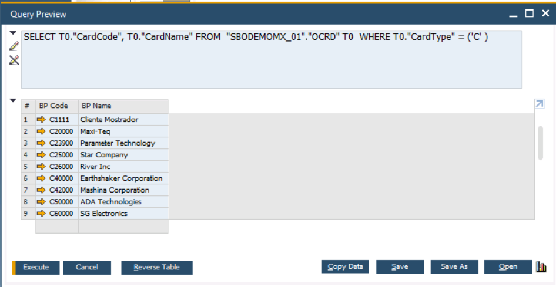

Clientes con saldo:

```sql
SELECT CardCode, CardName, Balance
FROM OCRD
WHERE Balance > 0;
```
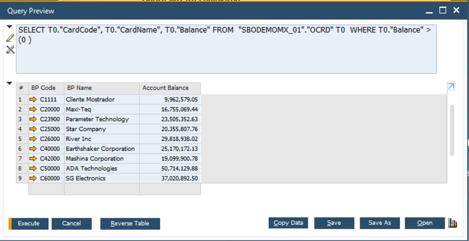

Clientes y contactos:

```sql
SELECT T0.CardCode,T0.CardName,T1.Name
FROM OCRD T0
INNER JOIN OCPR T1 ON T0.CardCode=T1.CardCode;
```
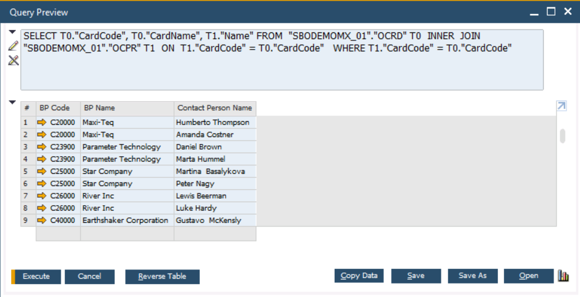
---

# Laboratorio 10 - Investigación de la Base de Datos

Explorar:

```sql
SELECT TOP 100 * FROM OCRD;
SELECT TOP 100 * FROM CRD1;
SELECT TOP 100 * FROM OCPR;
SELECT TOP 100 * FROM ORDR;
SELECT TOP 100 * FROM OINV;
SELECT TOP 100 * FROM ORCT;
```

---

# Proyecto Integrador

1. Crear cliente.
2. Configurar direcciones.
3. Crear contactos.
4. Asignar crédito.
5. Crear cotización.
6. Crear pedido.
7. Crear entrega.
8. Facturar.
9. Registrar pago.
10. Obtener reporte SQL.

Consulta final:

```sql
SELECT CardCode, CardName, Balance, CreditLine
FROM OCRD
WHERE CardCode='C-TRAIN-001';
```

---

# Reto Avanzado

Construir una consulta que muestre:

- Cliente
- RFC
- Condición de pago
- Saldo
- Crédito disponible
- Última factura
- Último pago
- Total vendido del año

Utilizando OCRD, OCTG, OINV, INV1, ORCT y RCT2.
